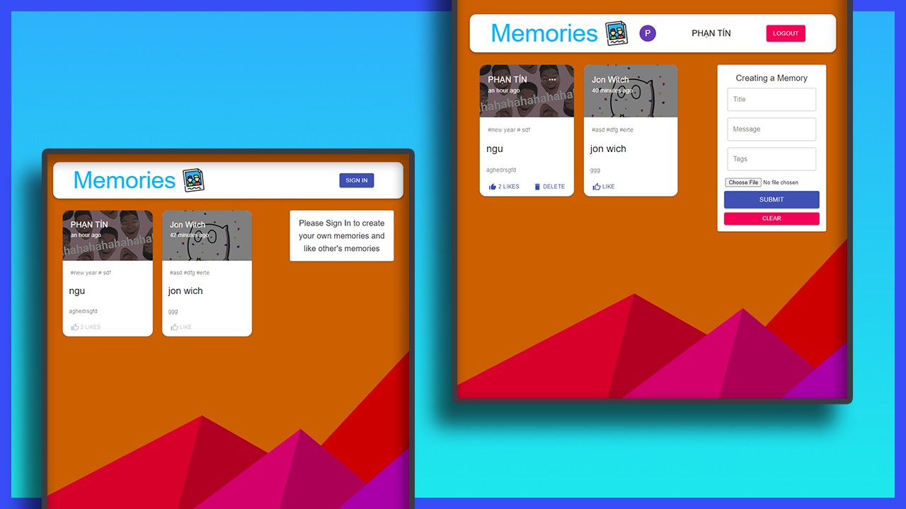

# Memories
### A Social Media Web App built using MERN stack  

### Current Features
- Registration and login using a secure Authentication System
- Google Sign in using OAuth Client
- Create, Like, Delete, Update Posts

## Libraries Used : 
### For Frontend
- React (Javascript Framework)
- Redux
- Material UI
- Axios
- React Router
- react-google-login
- jwt-decode

### For Backend
- Nodejs
- Express JS
- Mongoose
- bcryptjs

### Database
- MongoDB

### Screenshot

- 

### Release

Live Site:

- https://memories.tinspham.info/
- https://memories-application.web.app/

Live Server:

- https://memories-application-server.herokuapp.com/

### Tech-Stack

- Client:

  - react
  - @material-ui/core
  - react-redux
  - redux@4.0.5
  - redux-thunk@2.3.0
  - axios@0.21.0
  - react-file-base64@1.0.3
  - moment@2.29.1
  - jwt-decode@3.1.2
  - react-google-login@5.2.2

- Server:
  - body-parser@1.19.0
  - express@4.17.1
  - mongoose@5.10.11
  - cors@2.8.5
  - nodemon
  - morgan
  - jsonwebtoken@8.5.1
  - bcryptjs@2.4.3

### Plan Of Action

**Phrase 1:**

- Initial Project
- Draw Architecture Structure
- Backend Setup
- Frontend Setup
- server: index.js Setup
- MongoDB Setup
- Connecting to the Database in cloud.mongodb
- Routing
- Backend Folder Structure
- Controllers
- JSX Structure
- Styling
- setup Redux
- Form structure JSX
- Create a Post and send to server
- fetch Posts from server and load to UI
- Update Post in server
- Update Post in client
- Delete Post in server
- Delete Post in client
- Like Post in server
- Like Post in client
- Fix UI
- Mobile Responsive
- Environmental Variables
- Deploy `/server` to heroku
- Deploy `/client` to firebase
- Add custom domain to `/client`
- Write `README.md` Document
- Screenshot of UI

**Phrase 2:**

- Refactor Layout with router
- Auth Form UI
- Google OAuth
- JWT Login
- JWT Auth Backend
- Auth Middleware
- JWT Login Frontend
- User Actions
- Like, delete & edit
- Token Expiry
- Deployment

### After this project

I have improve my knowledge about

- how to use redux in project
- CRUD in server (CREATE, READ, UPDATE, DELETE)
- separate each models, controllers, routes,
- Deploy client to firebase
- Styles CSS with Material-UI

I have understand about

- how to apply redux thunk to project
- structure with Material-UI
- how to style component with makeStyles
- working with mongoDB
- send database to cloud (cloud.mongodb.com)
- how to send setState of useState to children
- how to count a like of Post in server
- Deploy server to heroku
- Google OAuth
- what is Middleware and how to apply it in to project
- what is JWT and how to use
- JWT Auth Backend & Frontend
- Role for User Actions
- Token Expiry
